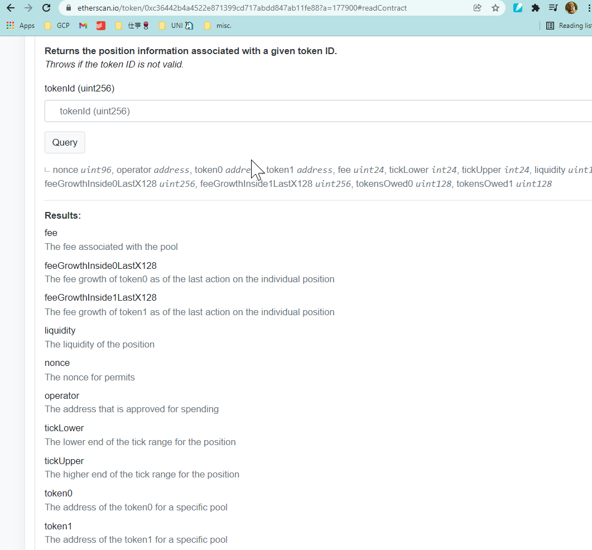

# cellar-monitor

# Tracking Liquidity Positions (Range Orders) on Uniswap v3

This section describes how to  monitor Sommelier Cellars consisting of Uniswap v3 liquidity positions  

For example, here are two UNI v3 positions that were minted by cellar contracts: [WBTC-WETH][WBTC-WETH-uniswap-app] and [DAI-WETH][DAI-WETH-uniswap-app].

[WBTC-WETH-uniswap-app]: https://app.uniswap.org/#/pool/171008?chain=mainnet
[DAI-WETH-uniswap-app]: https://app.uniswap.org/#/pool/177900?chain=mainnet

Initial thoughts on tracking needed data for Uniswap v3 range orders:

1. Use the contract address and query the event log on Etherscan (e.g. [event log](https://etherscan.io/address/0x13Ea4abA3F7e26D2B3D8E5BBB70D3b0EE2e44A72#events)). 
2. Then, grab the last AddedLiquidity  event, which has an internal transaction that interacts with the LP position NFT. 
3. This NFT contract has the attributes you're looking for (maybe in the logs?). It can be extracted on the NFT contract (e.g. [WBTC-WETH LP NFT contract](https://etherscan.io/token/0xc36442b4a4522e871399cd717abdd847ab11fe88?a=177900#readContract))
4. Read the positions attribute. It appears from the screenshot below that the position attribute has the range order ticks (and prices):

